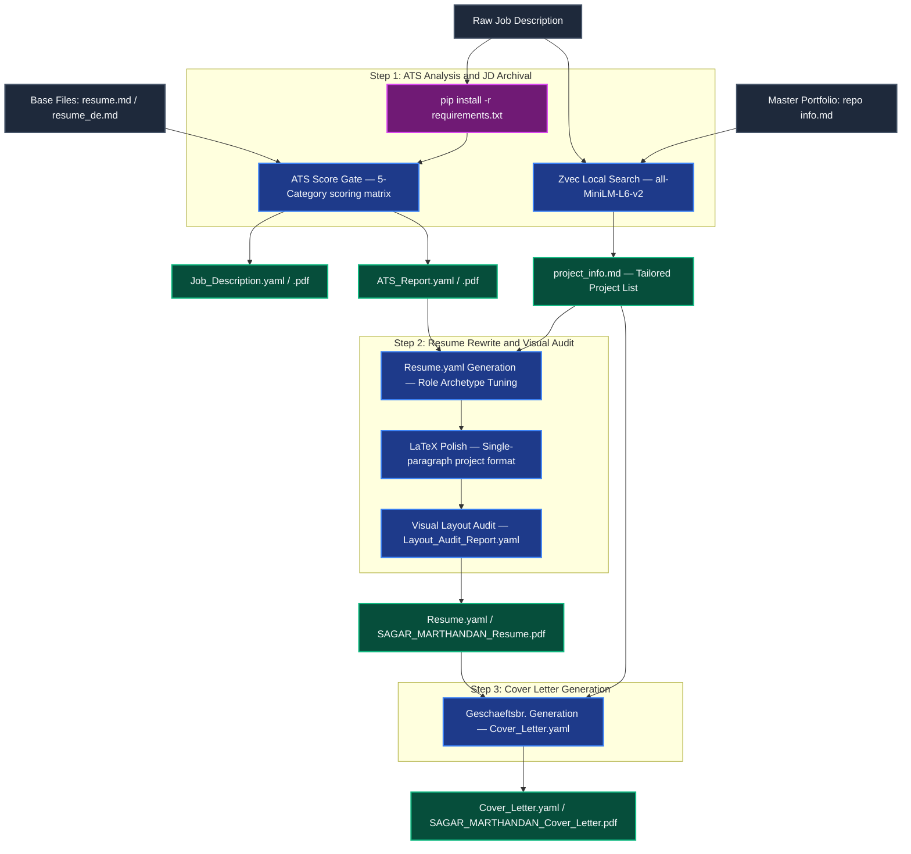

# 📄 Premium YAML-CV Resume & Cover Letter Tailoring Pipeline

An end-to-end, high-scannability, and ATS-optimized application materials generation pipeline. It uses structured YAML files for configuration, compiles them to PDF/LaTeX, and leverages a local **Zvec vector database** to dynamically rank and inject relevant engineering projects from a master portfolio based on a target Job Description (JD).

---

## 🗺️ Architectural Workflow

The following diagram illustrates the data flow, offline semantic search, and the three-stage generation lifecycle:



---

## 🛠️ Step-by-Step Execution Guide

The entire process is organized into 3 primary sequential steps, executed automatically by the agent when you supply a Job Description:

### STEP 1: Setup, ATS Analysis & Job Description Archival
- **Dependency Ingest:** Automatically installs/updates pip dependencies (`zvec`, `sentence-transformers`, `pyyaml`, `reportlab`, `pypdf`) using Python 3.12.
- **Language Detection:** Identifies whether the JD is in English or German and loads corresponding base resume files.
- **ATS Pre-Scoring:** Grades the base resume against a calibrated 5-category German-market matrix (max 100 points).
  - **Score Gate:** If the ATS score is `< 85`, the pipeline triggers a `HOLD` verdict, presenting specific remedy suggestions (e.g., missing keywords, project mismatches). If `>= 85`, it sets `PROCEED`.
- **RAG-based Project Selector:** Queries a local **Zvec vector database** (populated offline from your master portfolio) to search and write the top 4 matching projects to a tailored `project_info.md` file — distilled to title + description + tools only (no code blocks, badges, or noise sections).
- **Outputs:** `ATS_Report.yaml` & `Job_Description.yaml` (plus their compiled `.pdf` documents) and the tailored `project_info.md`.

### STEP 2: Resume Rewrite & Visual Layout Audit
- **Tuned Resume Generation:** Writes `Resume.yaml` by tailoring descriptions, skills, and summary to align with the target role archetype and the retrieved local projects.
- **LaTeX Compilation & Project Format Polish:** Generates a professional LaTeX resume (`SAGAR_MARTHANDAN_Resume.tex` or `SAGAR_MARTHANDAN_Lebenslauf.tex` for German) and converts project listings from standard bullet points into a compact, single-paragraph prose block with tools woven in naturally.
- **Uniform Spacing:** All project and experience entries are separated by a consistent `\vspace{6pt}` — no double-spacing, no variable gaps.
- **Constraints & Eye-Test Audit:** Runs character-length audits:
  - Experience bullets: Must be strictly single-line and `<= 105` characters.
  - Project paragraphs: Must be `<= 300` characters total (`<= 250` characters for German projects) and fit within `<= 3` lines.
  - Summary: Exactly 4 lines of text, maximum 420 characters (maximum 380 characters for German Zusammenfassung).
  - Stop-Slop writing rules: Strict active voice, no `-ly` adverbs, zero em-dashes, no filler text.
- **Self-Correction:** Resolves any line-wraps or overflows dynamically.
- **Post-Rewrite ATS Rescoring:** Updates `post_rewrite_ats_score` in `ATS_Report.yaml` and recompiles `ATS_Report.pdf`.
- **Outputs:** `Resume.yaml`, `SAGAR_MARTHANDAN_Resume.pdf` / `SAGAR_MARTHANDAN_Lebenslauf.pdf` (along with preserved LaTeX `.tex` sources), `Layout_Audit_Report.yaml`, and the post-rewrite ATS rescoring results updated inside `ATS_Report.yaml`.

### STEP 3: Cover Letter Generation
- **Geschäftsbrief Layout:** Generates a metric-grounded cover letter adapted to formal German business formatting.
- **Strict Limits:** Restricts cover letter content to exactly one page, 4 paragraphs, and **250–320 words** total (restricted to **180–240 words** for German cover letters to prevent A4 overflow).
- **Outputs:** `Cover_Letter.yaml` and compiled `SAGAR_MARTHANDAN_Cover_Letter.pdf` / `SAGAR_MARTHANDAN_Anschreiben.pdf` (along with preserved LaTeX `.tex` sources).

---

## 💾 Offline RAG & Zvec Setup

To eliminate all cloud-based API key requirements, embedding costs, and data leakage, the RAG search runs **100% locally and offline**:
- **Vector DB:** Utilizes [Zvec](https://pypi.org/project/zvec/) as an embedded local database storage engine.
- **Local Model:** Generates 384-dimensional embeddings using the local `sentence-transformers` library running the lightweight `all-MiniLM-L6-v2` model (~90MB).
- **Auto-Ingestion:** The search script ([zvec_portfolio_search.py](file:///c:/Users/sagar/Documents/YAML-CV/skills/yaml-cv-pipeline/zvec_portfolio_search.py)) automatically reads, chunks, embeds, and indexes your master portfolio ([repo info.md](file:///C:/Users/sagar/Documents/YAML-CV/Base%20Files/Repo%20Info/repo%20info.md)) into the database folder [zvec_portfolio](file:///C:/Users/sagar/Documents/YAML-CV/Base%20Files/Repo%20Info/zvec_portfolio) if it does not already exist.
- **Distilled Output:** Each matched project is written to `project_info.md` as a compact 2–3 line summary (title + first prose paragraph + tech-stack line). Full content is used for semantic ranking; only signal is written to file.
- **Re-indexing:** Delete the `zvec_portfolio` folder manually to trigger a clean re-index after updating `repo info.md`.

---

## 📂 Project Directory Structure

```
C:\Users\sagar\Documents\YAML-CV\
├── Base Files\
│   ├── English\              # English base resume.md
│   ├── German\               # German base resume_de.md
│   ├── Photo\                # Sagar.jpg for LaTeX header template
│   └── Repo Info\
│       ├── repo info.md      # Master portfolio markdown file (indexed in Zvec)
│       └── zvec_portfolio\   # Local offline Zvec vector database folder
├── skills\
│   └── yaml-cv-pipeline\
│       ├── SKILL.md                      # Agent-facing skill metadata
│       ├── README.md                     # This file
│       ├── 01_ats_and_jd_archival.md     # Step 1 detailed agent rules
│       ├── 02_resume_and_visual_audit.md # Step 2 detailed agent rules
│       ├── 03_cover_letter.md            # Step 3 detailed agent rules
│       ├── requirements.txt              # Pipeline dependencies
│       ├── yaml_to_pdf.py                # Main YAML compilation router
│       ├── zvec_portfolio_search.py      # Zvec search, embedding & distillation engine
│       └── renderers\                    # LaTeX/ReportLab rendering handlers
└── Applications\
    └── [Company Name] — [Job Role]\      # Automatically created output folder
        ├── Job_Description.yaml / .pdf
        ├── ATS_Report.yaml / .pdf
        ├── project_info.md               # Tailored & distilled project list (2-3 lines/project)
        ├── Resume.yaml / Layout_Audit_Report.yaml / Cover_Letter.yaml
        ├── SAGAR_MARTHANDAN_Resume.pdf / .tex  (or Lebenslauf.pdf / .tex for German)
        └── SAGAR_MARTHANDAN_Cover_Letter.pdf / .tex  (or Anschreiben.pdf / .tex for German)
```

---

## 🚀 How to Run the Pipeline

Since all the pipeline steps are natively codified into the agent's custom skills directory, you do not need to copy-paste any external prompts.

To execute the pipeline:
1. Paste the target **Job Description** (JD) into the chat.
2. Type: **`execute yaml-cv-pipeline`** (or keywords like *"tailor resume"* / *"optimize resume"*).
3. The agent will automatically run the end-to-end flow: installing dependencies, searching matching projects using Zvec, compiling the ATS reports, and writing the final tailored files to the `C:\Users\sagar\Documents\YAML-CV\Applications\` directory.

---

## 📋 Changelog

### v8 — LaTeX Paragraph Separation Fix
**Files:** `renderers/resume.py`, `02_resume_and_visual_audit.md`

- Fixed projects (and experience entries) flowing together as one continuous block of text with no visual gap between them.
- **Root cause:** `\vspace{6pt}` between `\noindent` paragraphs was firing in LaTeX's horizontal mode (mid-paragraph) where it is a no-op. LaTeX must be in vertical mode for `\vspace` to produce actual vertical space.
- **Fix:** Added `\par` at the end of each `\end{itemize}` block in the generator (`resume.py`). `\par` explicitly ends the paragraph and switches LaTeX to vertical mode before the `\vspace{6pt}` separator fires.
- Updated `02_resume_and_visual_audit.md` Step 4 format rule to require `.\par` at the end of every project paragraph in the LaTeX polish step, with a Critical callout explaining the horizontal/vertical mode mechanic.

---

### v7 — Zvec API Deprecation Fix & Warning Suppression
**Files:** `zvec_portfolio_search.py`

- Replaced deprecated `zvec.VectorQuery("embedding", vector=...)` with the current `zvec.Query(field_name="embedding", vector=...)` API — eliminates the `DeprecationWarning` on every run.
- Added `os.environ.setdefault("HF_HUB_DISABLE_IMPLICIT_TOKEN", "1")` and `TOKENIZERS_PARALLELISM=false` at module load time to suppress the harmless HuggingFace Hub unauthenticated-request warning (model is already cached locally, no network calls are made).

---

### v6 — README Changelog & Mermaid Diagram Fix
**Files:** `README.md`

- Added full `## Changelog` section to `README.md` documenting all changes from v1–v5 with files affected, rationale, and bullet-point summaries.
- Fixed Mermaid architectural diagram for GitHub compatibility:
  - Replaced `&` with `and` in all node labels and subgraph titles (GitHub's Mermaid parser treats `&` as a syntax token).
  - Split multi-source arrow syntax (`A & B --> C`) into individual arrows — not supported in GitHub's Mermaid version.
  - Replaced `<br>` multi-line node labels with single-line labels using em-dashes.
  - Quoted all subgraph titles to prevent parse errors on special characters.

---

### v5 — RAG Output Distillation
**Files:** `zvec_portfolio_search.py`

- Added `distill_project()` helper that strips each matched project's raw markdown to just the signal Step 2 needs: project title + first prose paragraph + tech-stack line.
- Previously, each project's full raw markdown (code blocks, badges, troubleshooting sections, install instructions) was dumped into `project_info.md` — resulting in ~400 lines for 4 projects.
- Now `project_info.md` is ~12 lines for 4 projects. Full content is still used for semantic ranking; only the distilled output is written.
- Skips: code fences, `[![badge]...]` image lines, all sub-headers beyond the title, bullet lists, empty lines, and noise sections.

---

### v4 — Consistent LaTeX Spacing Across Sections
**Files:** `renderers/resume.py`, `02_resume_and_visual_audit.md`

- Fixed inconsistent vertical spacing between project and experience entries in the generated LaTeX.
- Changed inter-entry join separator from `\vspace{8pt}` → `\vspace{6pt}` uniformly for both Projects and Professional Experience sections.
- Replaced the implicit `\\[2pt]` line-break after each `\jobEntry` with an explicit `\vspace{2pt}` for deterministic, consistent spacing.
- Increased internal header-to-content gap from `\vspace{1pt}` → `\vspace{2pt}` in both Projects and Experience sections.
- Removed the trailing `\vspace{6pt}` from inside each project paragraph (was causing double-spacing when combined with the join separator). Inter-project spacing is now fully owned by the single `\vspace{6pt}` join.
- Updated the character-count audit script regex in Step 2 instructions to match project paragraphs without relying on `\vspace` as the terminator.

---

### v3 — German Language Support & Post-Rewrite ATS PDF Fix
**Files:** `02_resume_and_visual_audit.md`, `03_cover_letter.md`, `SKILL.md`, `README.md`, `renderers/cover_letter.py`, `test_zvec_search.py`, `zvec_portfolio_search.py`

**German Language Adaptations:**
- Resume output renamed to `SAGAR_MARTHANDAN_Lebenslauf.pdf` / `.tex` when JD is in German.
- Cover letter output renamed to `SAGAR_MARTHANDAN_Anschreiben.pdf` / `.tex` when JD is in German.
- German resume summary (Zusammenfassung) capped at **340–380 characters** (vs 420 for English) to prevent 5th-line overflow from longer German compound words.
- German project paragraphs (Projekte) capped at **230–250 characters** (vs 300 for English) to guarantee ≤ 3 lines.
- German cover letter (Anschreiben) limited to **180–240 words** total (vs 250–320 for English), reducing each paragraph by 10–20 words to prevent A4 page overflow.
- Step 2 compilation and character-count audit scripts updated with conditional English/German paths and limits.

**Post-Rewrite ATS Rescoring Fix:**
- After the resume rewrite, `ATS_Report.yaml` is updated with `post_rewrite_ats_score`. Step 2 now explicitly re-runs `yaml_to_pdf.py` to recompile `ATS_Report.pdf` so the PDF reflects the updated scores.

**Robustness Fixes:**
- Parser filter in `zvec_portfolio_search.py` updated from first-word matching to full-phrase prefix matching — prevents projects titled "Run Tracker" or "On-Demand Analytics" from being silently dropped.
- `test_zvec_search.py` updated with real assertions (not just score printing) to verify relevance ranking doesn't regress.

---

### v2 — Master README & Pipeline Documentation
**Files:** `README.md`

- Created the master `README.md` documenting the full pipeline architecture, Zvec offline RAG setup, step-by-step execution guide, and directory structure.
- Added the Mermaid architectural workflow diagram.

---

### v1 — Initial Pipeline Implementation
**Files:** All core files (initial commit)

- Full 3-step YAML CV pipeline: ATS analysis & JD archival (Step 1), resume rewrite & LaTeX visual audit (Step 2), cover letter generation (Step 3).
- LaTeX primary renderer with ReportLab fallback for all 4 document types (resume, cover letter, job description, ATS report).
- Offline Zvec vector database integration using local `all-MiniLM-L6-v2` sentence embeddings for portfolio search.
- Auto-seeding: Zvec database is built on first run from `repo info.md` if it doesn't exist.
- `.tex` source files preserved for resume and cover letter (cleaned up for JD and ATS report).
- ATS Score Gate: pipeline halts with remedy suggestions if pre-rewrite score is `< 85`.
- Stop-Slop writing rules enforced across all generated text (active voice, adverb ban, zero em-dashes).
- Automated pip dependency installation at Step 1 start.
- `SKILL.md`, `01_ats_and_jd_archival.md`, `02_resume_and_visual_audit.md`, `03_cover_letter.md` codified as agent-native skill instructions.
