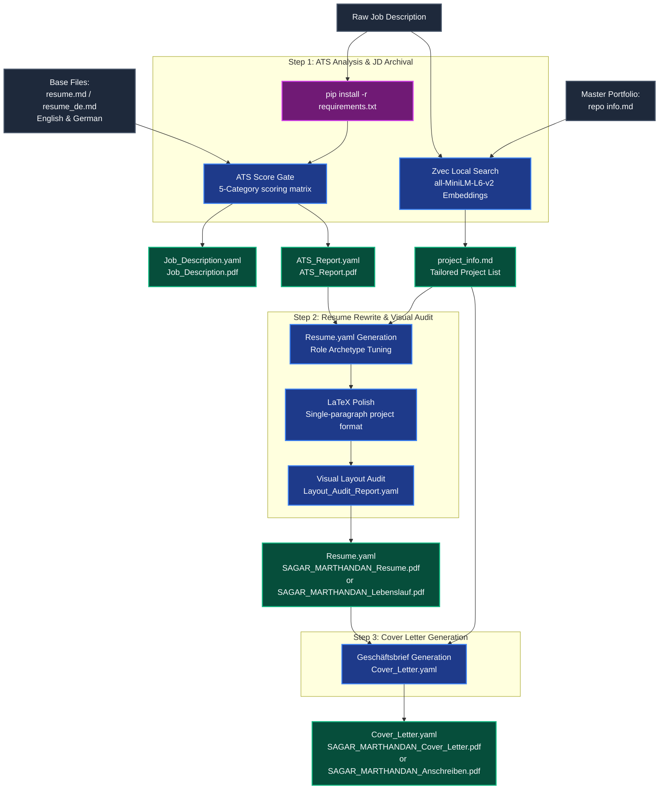

# 📄 Premium YAML-CV Resume & Cover Letter Tailoring Pipeline

An end-to-end, high-scannability, and ATS-optimized application materials generation pipeline. It uses structured YAML files for configuration, compiles them to PDF/LaTeX, and leverages a local **Zvec vector database** to dynamically rank and inject relevant engineering projects from a master portfolio based on a target Job Description (JD).

---

## 🗺️ Architectural Workflow

The following diagram illustrates the data flow, offline semantic search, and the three-stage generation lifecycle:



---

## 🛠️ Step-by-Step Execution Guide

The entire process is organized into 3 primary sequential steps, executed automatically by the agent when you supply a Job Description:

### STEP 1: Setup, ATS Analysis & Job Description Archival
- **Dependency Ingest:** Automatically installs/updates pip dependencies (`zvec`, `sentence-transformers`, `pyyaml`, `reportlab`, `pypdf`) using Python 3.12.
- **Language Detection:** Identifies whether the JD is in English or German and loads corresponding base resume files.
- **ATS Pre-Scoring:** Grades the base resume against a calibrated 5-category German-market matrix (max 100 points).
  - **Score Gate:** If the ATS score is `< 85`, the pipeline triggers a `HOLD` verdict, presenting specific remedy suggestions (e.g., missing keywords, project mismatches). If `>= 85`, it sets `PROCEED`.
- **RAG-based Project Selector:** Queries a local **Zvec vector database** (populated offline from your master portfolio) to search and write the top 4 matching projects to a tailored `project_info.md` file inside the application directory.
- **Outputs:** `ATS_Report.yaml` & `Job_Description.yaml` (plus their compiled `.pdf` documents) and the tailored `project_info.md`.

### STEP 2: Resume Rewrite & Visual Layout Audit
- **Tuned Resume Generation:** Writes `Resume.yaml` by tailoring descriptions, skills, and summary to align with the target role archetype and the retrieved local projects.
- **LaTeX Compilation & Project Format Polish:** Generates a professional LaTeX resume (`SAGAR_MARTHANDAN_Resume.tex` or `SAGAR_MARTHANDAN_Lebenslauf.tex` for German) and converts project listings from standard bullet points into a compact, single-paragraph prose block with tools woven in naturally.
- **Constraints & Eye-Test Audit:** Runs character-length audits:
  - Experience bullets: Must be strictly single-line and `<= 105` characters.
  - Project paragraphs: Must be `<= 300` characters total (<= 250 characters for German projects) and fit within `<= 3` lines.
  - Summary: Exactly 4 lines of text, maximum 420 characters (maximum 380 characters for German Zusammenfassung).
  - Stop-Slop writing rules: Strict active voice, no `-ly` adverbs, zero em-dashes, no filler text.
- **Self-Correction:** Resolves any line-wraps or overflows dynamically.
- **Outputs:** `Resume.yaml`, `SAGAR_MARTHANDAN_Resume.pdf` / `SAGAR_MARTHANDAN_Lebenslauf.pdf` (along with preserved LaTeX `.tex` sources), `Layout_Audit_Report.yaml`, and the post-rewrite ATS rescoring results updated inside `ATS_Report.yaml`.

### STEP 3: Cover Letter Generation
- **Geschäftsbrief Layout:** Generates a metric-grounded cover letter adapted to formal German business formatting.
- **Strict Limits:** Restricts cover letter content to exactly one page, 4 paragraphs, and **250–320 words** total (restricted to **180–240 words** for German cover letters).
- **Outputs:** `Cover_Letter.yaml` and compiled `SAGAR_MARTHANDAN_Cover_Letter.pdf` / `SAGAR_MARTHANDAN_Anschreiben.pdf` (along with preserved LaTeX `.tex` sources).

---

## 💾 Offline RAG & Zvec Setup

To eliminate all cloud-based API key requirements, embedding costs, and data leakage, the RAG search runs **100% locally and offline**:
- **Vector DB:** Utilizes [Zvec](https://pypi.org/project/zvec/) as an embedded local database storage engine.
- **Local Model:** Generates 384-dimensional embeddings using the local `sentence-transformers` library running the lightweight `all-MiniLM-L6-v2` model (~90MB).
- **Auto-Ingestion:** The search script ([zvec_portfolio_search.py](file:///c:/Users/sagar/Documents/YAML-CV/skills/yaml-cv-pipeline/zvec_portfolio_search.py)) automatically reads, chunks, embeds, and indexes your master portfolio ([repo info.md](file:///C:/Users/sagar/Documents/YAML-CV/Base%20Files/Repo%20Info/repo%20info.md)) into the database folder [zvec_portfolio](file:///C:/Users/sagar/Documents/YAML-CV/Base%20Files/Repo%20Info/zvec_portfolio) if it does not already exist.

---

## 📂 Project Directory Structure

```
C:\Users\sagar\Documents\YAML-CV\
├── Base Files\
│   ├── English\              # English base resume.md and project_info.md
│   ├── German\               # German base resume_de.md
│   ├── Photo\                # Sagar.jpg for LaTeX header template
│   └── Repo Info\
│       ├── repo info.md      # Master portfolio markdown file (indexed in Zvec)
│       └── zvec_portfolio\   # Local offline Zvec vector database folder
├── skills\
│   └── yaml-cv-pipeline\
│       ├── SKILL.md                 # Agent-facing skill metadata
│       ├── README.md                # This file (Pipeline overview & setup documentation)
│       ├── 01_ats_and_jd_archival.md # Step 1 detailed agent rules
│       ├── 02_resume_and_visual_audit.md # Step 2 detailed agent rules
│       ├── 03_cover_letter.md       # Step 3 detailed agent rules
│       ├── requirements.txt         # Pipeline dependencies
│       ├── yaml_to_pdf.py           # Main YAML compilation router
│       ├── zvec_portfolio_search.py # Zvec search & embedding engine
│       └── renderers\               # LaTeX/ReportLab rendering handlers
└── Applications\
    └── [Company Name] — [Job Role]\ # Automatically created output folder for each job
        ├── Job_Description.yaml / .pdf
        ├── ATS_Report.yaml / .pdf
        ├── project_info.md          # Tailored project list
        ├── Resume.yaml / Layout_Audit_Report.yaml / Cover_Letter.yaml
        ├── SAGAR_MARTHANDAN_Resume.pdf / .tex (or SAGAR_MARTHANDAN_Lebenslauf.pdf / .tex)
        └── SAGAR_MARTHANDAN_Cover_Letter.pdf / .tex (or SAGAR_MARTHANDAN_Anschreiben.pdf / .tex)
```

---

## 🚀 How to Run the Pipeline

Since all the pipeline steps are natively codified into the agent's custom skills directory, you do not need to copy-paste any external prompts.

To execute the pipeline:
1. Paste the target **Job Description** (JD) into the chat.
2. Type: **`execute yaml-cv-pipeline`** (or keywords like *"tailor resume"* / *"optimize resume"*).
3. The agent will automatically run the end-to-end flow: installing dependencies, searching matching projects using Zvec, compiling the ATS reports, and writing the final tailored files to the `C:\Users\sagar\Documents\YAML-CV\Applications\` directory.
